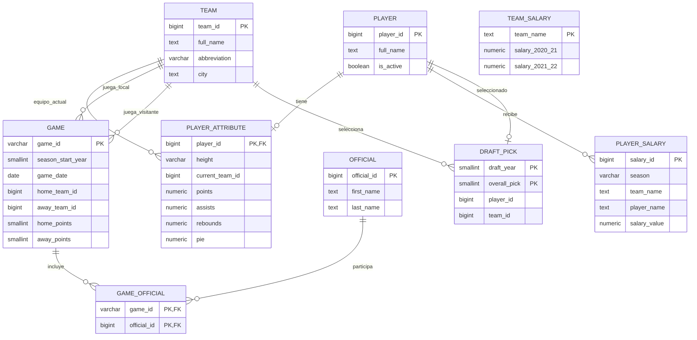

# Modelo entidad-relación preliminar

Este modelo incluye únicamente las entidades necesarias para el primer análisis. Es deliberadamente menor que los 149 campos del archivo de partidos.

## Nota sobre integridad referencial

Los partidos incluyen franquicias históricas que no aparecen en `Team.csv`, que contiene 30 equipos actuales. Por eso las relaciones desde `game` hacia `team` se documentan conceptualmente, pero el esquema inicial no impone esas claves foráneas. Primero debemos incorporar `Team_History.csv` o diseñar una dimensión histórica de franquicias.
